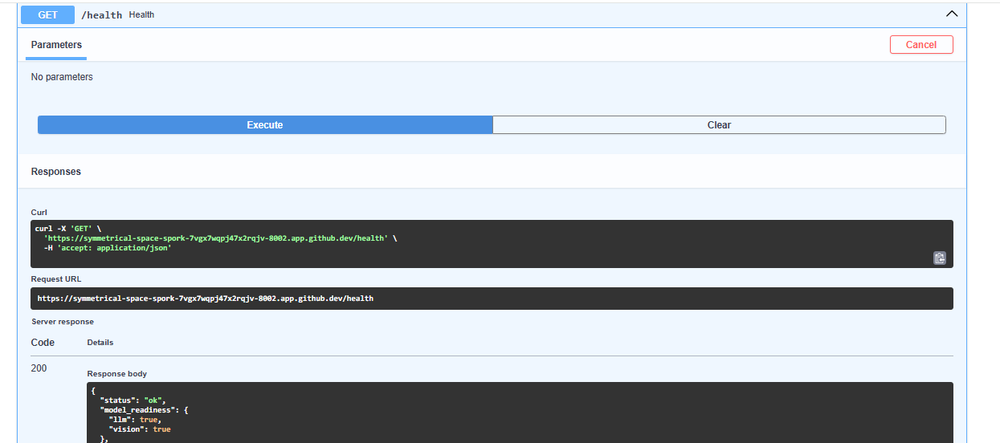

1. PROBLEM STATEMENT (Domain-Specific, 500–800 words)
Modern vehicles come with extensive owner manuals that span hundreds of pages and include a mix of textual instructions, structured tables, and visual diagrams. While these manuals are comprehensive, they are not optimized for real-time information retrieval. Users often struggle to quickly find relevant information when facing urgent situations such as warning indicators, maintenance queries, or driving conditions.

For example, a user may want to know:

“What should I do when driving through water?”
“What does this dashboard warning light indicate?”
“Where should a child seat be placed?”

Traditional keyword-based search systems are insufficient in this context for several reasons. First, they lack semantic understanding, meaning they cannot effectively map user intent to relevant sections of the manual. A search for “rain driving” may not retrieve sections labeled “Driving on Wet Roads.” Second, these systems fail to handle multimodal content such as images and tables. Dashboard icons, safety diagrams, and structured tables (e.g., child restraint systems) are critical for understanding but remain inaccessible to text-only search systems.

Additionally, users increasingly expect natural language interaction, where they can ask questions conversationally instead of navigating through indexes or scanning PDFs manually. This creates a need for a system that can interpret user intent, retrieve relevant content, and generate accurate, context-aware responses.

A Multimodal Retrieval-Augmented Generation (RAG) system addresses these challenges effectively. It combines:

Retrieval of relevant document chunks using semantic embeddings
Generation of answers using a Large Language Model (LLM)
Integration of a Vision Language Model (VLM) to interpret images

This approach ensures that responses are grounded in the source document, reducing hallucinations and improving reliability.

The system processes:

Text → Instructions, warnings, procedures
Tables → Structured safety and configuration data
Images → Dashboard indicators, diagrams

Example query types:

Text Query: “How to drive safely in heavy rain?”
Table Query: “Where should a 5-year-old child sit?”
Image Query: Upload a dashboard warning icon

Expected outcomes:

Accurate, context-aware answers
Multimodal query handling
Reduced manual search effort
Scalable system for multiple documents

2. SYSTEM ARCHITECTURE
🔷 Components
1. Ingestion Pipeline
Extract text, tables, images from PDF
2. Processing Layer
Chunking
Metadata tagging
3. Embedding Layer
Convert content → vectors
4. Vector Store
Store embeddings (FAISS/Chroma)
5. Retrieval Pipeline
Semantic search
6. RAG Generation
LLM + retrieved context
7. FastAPI Layer
REST APIs

Mermaid Diagram

3. TECHNOLOGY SELECTION
| Component    | Choice                             | Reason                   |
| ------------ | ---------------------------------- | ------------------------ |
| PDF Parser   | PyMuPDF + pdfplumber               | Handles text + tables    |
| Embeddings   | sentence-transformers (all-MiniLM) | Fast + lightweight       |
| Vector DB    | FAISS                              | Local, fast              |
| LLM          | OpenAI GPT / Llama3                | High-quality reasoning   |
| Vision Model | BLIP / GPT-4o Vision               | Image understanding      |
| Framework    | FastAPI                            | Async + production-ready |

4. Setup Instructions
🔹 Step 1: Clone Repository
git clone https://github.com/your-username/multimodal-rag-automotive.git
cd multimodal-rag-automotive
🔹 Step 2: Install Dependencies
pip install -r requirements.txt
🔹 Step 3: Configure Environment

Create .env file:

OPENAI_API_KEY=your_api_key_here
🔹 Step 4: Run Server
uvicorn main:app --reload
🔹 Step 5: Open API Docs
http://127.0.0.1:8000/docs

5. API Documentation
✅ Health Check

GET /health

Response:

{
  "status": "ok"
}
📄 Ingest Document

POST /ingest

Request:

Form-data → file (PDF)

Response:

{
  "message": "Document ingested successfully"
}
🔍 Query

POST /query

Request:

{
  "q": "How to drive in rain?"
}

Response:

{
  "answer": "Reduce speed, avoid sudden braking..."
}
🖼️ Image Query

POST /image-query

Request:

Form-data → image file

Response:

{
  "description": "A dashboard warning light indicating engine issue"
}

6. Screenshots

7. Limitations & Future Work
❌ Current Limitations
No persistent vector database (FAISS in-memory)
No advanced chunking (basic page-level split)
Limited table understanding (treated as text)
Vision model accuracy is basic (BLIP limitations)
No authentication or user management
No UI (API only)
🚀 Future Improvements
Use ChromaDB / Pinecone for persistence
Implement semantic chunking (LangChain)
Add table-aware parsing
Upgrade to GPT-4 Vision
Add frontend (Streamlit / React)
Implement Docker + CI/CD
Add multi-document support
Introduce query caching

